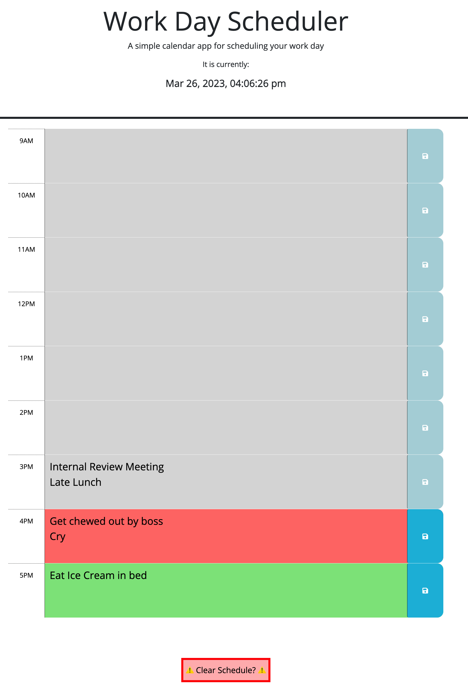

# parker-brook-daily-planner-challenge05
Repo for Challenge 05 - Daily Planner

## Description
This project is a daily workday planner that takes in user-entered events on a per-hour basis and saves the information. It features dynamically changing colors based on the past hours, present hour, and future hours.

Link to deployed planner: https://pbodybrooks.github.io/parker-brook-daily-planner-challenge05/

## Screenshot

## Installation
N/A

## Credits
A lot of W3 and MDN to get the syntax for jQuery correct, as I didn't have much of it memorized prior to this project.

## License
Please refer to repo.

## Features
This project features the use of jQuery, JavaScript, HTML, and CSS to create the planner. I used event listeners, local storage, dynamic classes, and a lot of DOM traversals to accomplish the functional webpage.